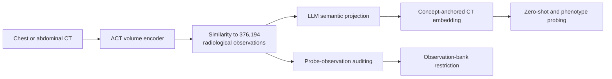

# ACT

**Auditable CT phenotyping through report-derived radiological observations**

> A CT model can phenotype patients for reasons that are not evidence for the
> phenotype. ACT grounds 3D CT representations in report-derived radiological
> observations, so the reasons can be read and changed.

**Manuscript under submission.**

[Model weights](https://huggingface.co/peterhan91/clip_3d_ct) |
[Citation](#citation)

ACT maps a native-resolution chest or abdominal CT volume to similarities with
**376,194 report-derived radiological observations**, then projects those
scores through a large language model (LLM) embedding space. This makes a
prediction decomposable into named observations and supports zero-shot
annotation, phenotype probing, probe auditing, and observation-bank
restriction without retraining the image encoder.

The model was pretrained on volume-report pairs from **38,317 patients**
(CT-RATE and Merlin) and evaluated in **25,183 held-out patients**. It
exceeded five vision-language baselines on zero-shot annotation, and CT-CLIP
across **221 EHR phenotypes** from unseen CT pulmonary angiography, under both
zero-shot scoring (**0.651 versus 0.572**) and linear probing (**0.709 versus
0.662**). In the paper's restriction analysis, limiting each probe to
clinically trusted observations raised mean AUROC across 86 phenotypes from
**0.741 to 0.751** (55 phenotypes higher, 31 lower) without touching the
encoder.



## What is in this repository

- The ACT volume-report model: DINOv2 ViT-B/14 slice encoder with register
  tokens, two-layer Transformer slice fusion, and a paired CLIP-style text
  tower, with DDP training, inference, and zero-shot evaluation (`model/`).
- A Hugging Face-backed loader for the released checkpoint
  (`model/load_pretrained.py`) and the recovered training recipe
  (`model/run_scripts/train_release_v1.sh`).
- Native CT preprocessing from NIfTI to HDF5, report cleaning, impression
  generation, and dataset split construction (`preprocessing/`,
  `analysis/preprocess_new/`).
- Observation-bank extraction and LLM embedding, the concept-anchored
  representation, phenotype probing, the probe-observation audit, and the
  observation-bank restriction experiments, with statistics and figure
  generation (`analysis/`).
- The 221-phenotype label-building scripts and phecode rule manifests
  (`phenotypes/`).

## Installation

ACT requires Python 3.10 or newer. Clone the repository and install the core
dependencies in an environment with a PyTorch build appropriate for your
hardware:

```bash
git clone https://github.com/peterhan91/ACT.git
cd ACT
pip install -r requirements.txt
```

Optional stacks (concept extraction, figures, external preprocessing,
baselines) are listed as commented extras in `requirements.txt`. Model weights
are downloaded from Hugging Face on first use and cached locally. The loader
obtains the DINOv2 backbone code through `torch.hub`; the ACT checkpoint
supplies all model weights.

## Quick start: vision-language backbone

`load_act()` downloads the released `clip_3d_ctrate_merlin_v1` checkpoint and
returns the model together with the tokenizing text preprocessor:

```python
import sys, torch
sys.path.insert(0, "model")
from load_pretrained import load_act
from train import preprocess_text

device = "cuda" if torch.cuda.is_available() else "cpu"
model, _ = load_act(device=device)

# volume: one preprocessed CT from preprocessing/run_preprocess.py,
# a (160, 224, 224) uint8 array repeated to 3 channels
img = torch.from_numpy(volume[None].repeat(3, 0)).float()[None].to(device)
text = preprocess_text(["pleural effusion", "no pleural effusion"], model).to(device)

with torch.inference_mode():
    v = torch.nn.functional.normalize(model.encode_image(img), dim=-1)
    t = torch.nn.functional.normalize(model.encode_text(text), dim=-1)
    pair_scores = (v @ t.T).softmax(dim=-1)

print(pair_scores)  # [[positive_score, negative_score]]
```

This is a **backbone demonstration**: it compares one volume with a
positive-negative prompt pair in the shared 768-dimensional space, exactly the
scoring of `model/run_test.py`. It does not reproduce the full concept
projection, probing, or auditing experiments.

## Full concept pipeline

The full published framework follows five stages:

1. Preprocess volumes with `preprocessing/run_preprocess.py` (RAS
   reorientation, HU clip to [-1000, 1000], aspect-preserving resize and pad
   to 160 x 224 x 224, uint8 HDF5).
2. Extract atomic observations from CT-RATE and Merlin reports with
   `analysis/get_concepts_ct.py` (served by vLLM; the prompts are inline in
   the script), then embed the deduplicated bank with
   `analysis/get_embed_ct.py` (F2LLM is the paper's embedder).
3. Project volume features through the observation bank into the
   concept-anchored representation (`analysis/clear3d/`).
4. Train phenotype probes: `analysis/run_v1_phenotype_lbfgs_f2llm.sh` and the
   20-seed runs in `analysis/experiments/exp4_confounder_audit/run_pheno_probe.sh`;
   labels come from `phenotypes/extract_inspect_per_ct_phenotypes.py` with
   the Phecode Map v1.2 manifests.
5. Audit and restrict: the Equation 2 alignment exports in
   `analysis/experiments/exp4_confounder_audit/` (`export_f2llm_adam_top25.py`,
   `build_f2llm_natural_clinical_audit.py`), the restriction rules in
   `analysis/trusted_concept_space.py`, restricted probes in
   `analysis/trusted_concept_probe.py`, and the evaluation and supplementary
   tables in `analysis/experiments/supplementary/`.

The zero-shot benchmark against the vision-language baselines lives in
`analysis/experiments/exp1_zeroshot/` (one subdirectory per baseline with its
own faithful preprocessing), retrieval in
`analysis/experiments/exp3_concept_retrieval/`, and the figure scripts next to
the experiments that produce their data.

The released checkpoint is hosted on
[Hugging Face](https://huggingface.co/peterhan91/clip_3d_ct):

| File | Contents | Role |
| --- | --- | --- |
| `clip_3d_ctrate_merlin_v1/best_model.pt` | ACT volume encoder and paired text tower | Produces 768-dimensional volume and text features |

Redistributable observation-bank artefacts will accompany the published
article on the same repository.

## Reproducibility notes

- Use the released preprocessing; the published model was evaluated on
  160 x 224 x 224 volumes produced by `preprocessing/run_preprocess.py`. The
  CT-RATE validation carve is `preprocessing/split_validation.py` (seed 42,
  summarized in `preprocessing/manifests/ctrate_split_summary.json`).
- For a fixed model snapshot, pass a Hugging Face commit hash through
  `load_act(revision=...)` rather than relying on the repository default.
- The probe-observation alignment score of Figures 5 and 6 (the paper's
  Equation 2) uses **raw, unnormalized probe weights**, implemented in
  `analysis/experiments/exp4_confounder_audit/export_f2llm_adam_top25.py` and
  `build_f2llm_natural_clinical_audit.py`. The cosine variant in
  `analysis/concept_audit_20seeds.py` supplies only the top-100 subset
  selection for the Figure 6 baseline arm and is marked accordingly.
- The Figure 3 UMAP was deliberately fitted without a fixed random seed; exact
  coordinates differ between runs, quantitative claims do not.
- Training ran on 2x NVIDIA A100 (CUDA 12.4, torchrun DDP); analysis ran on
  Python 3.12 with torch 2.11 on an NVIDIA GH200. The recovered training
  configuration is documented in `model/run_scripts/train_release_v1.sh`.
- Evaluation datasets have their own access requirements and licenses. This
  repository redistributes no imaging, reports, or patient-level data; scripts
  read your own gated copies through paths set via CLI flags or `.env`
  (template: `.env.example`).

## Intended use and limitations

ACT is released for research on 3D CT representation learning, concept-level
analysis, zero-shot evaluation, phenotype probing, model auditing, and
interpretable model development. It is **not a medical device and is not
validated for clinical decision-making**. Predictions and observation
attributions require independent validation for each population, acquisition
setting, and task. They should not be used to diagnose, treat, or triage
patients.

Model weights are released for academic research. Review the terms
accompanying the [Hugging Face assets](https://huggingface.co/peterhan91/clip_3d_ct)
and the licenses of all upstream models and datasets before reuse.

## Repository layout

```text
model/            Volume-report model: architecture, training, inference, HF loader
preprocessing/    Native CT preprocessing, report cleaning, split construction
analysis/         Observation bank, concept representation, probing, audit,
                  restriction, statistics, and figures (analysis/experiments/)
phenotypes/       221-phenotype label building and phecode rule manifests
requirements.txt  Core dependencies and commented extras
CITATION.cff      Machine-readable citation metadata
LICENSE           Apache-2.0 license text
```

## Citation

A journal reference will be added upon publication. Until then, GitHub reads
the machine-readable [`CITATION.cff`](CITATION.cff) file and offers a
**Cite this repository** action.

## License

Apache License 2.0 (see [`LICENSE`](LICENSE)). Vendored components keep their
original MIT licenses and per-file headers: OpenAI CLIP (`model/model.py`,
`model/clip.py`, `model/simple_tokenizer.py`, the BPE vocabulary), Meta
V-JEPA 2 (`model/attentive_pooler.py`), CheXzero (`model/eval.py`), and
OpenCLIP (`model/loss.py`). The phecode manifests in `phenotypes/` are PheWAS
Catalog resources ([phewascatalog.org](https://phewascatalog.org/phecodes)),
redistributed with attribution. RadLex 4.3 is not redistributed: download it
from [radlex.org](https://radlex.org) under the RSNA license. DINOv2 backbone
weights are fetched at runtime via `torch.hub`.
